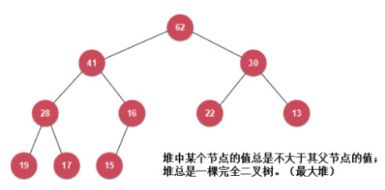
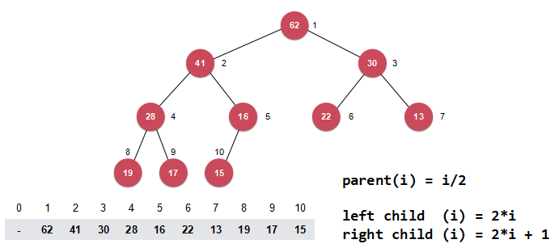
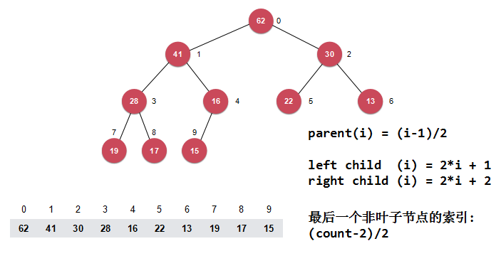

## 堆

#### 堆基础

- 普通队列：先进先出，后进后出

- 优先队列：出队顺序和入队顺序无关，和优先级有关

- 应用

  OS**动态**选择优先级最高的任务执行

  在n个元素中选出前m个元素，可降低到`O(nlogm)`

- 复杂度

  |          |   入队    |   出队    |
  | :------: | :-------: | :-------: |
  | 普通数组 |  `O(1)`   |  `O(n)`   |
  | 顺序数组 |  `O(n)`   |  `O(1)`   |
  |    堆    | `O(logn)` | `O(logn)` |


#### 堆的基本实现

- 二叉堆（最大堆、最小堆）

  最大堆：根节点的值是所有堆节点值中的最大者，且每个节点的值都比其孩子节点的值大

  最小堆：根节点的值是所有堆节点值中的最小者，且每个节点的值都比其孩子节点的值小

  

- 用数组存储二叉堆

  **根节点下标从1开始** （简单）

  


#### Shift Up

**调整堆中索引为k的元素，将这个元素向上调整到合适的位置**

最大堆：从索引为k的元素节点开始， 用该节点和其父节点比较，如果该节点大于父节点，则交换位置，然后继续向上调整，否则结束


#### Shift Down

**调整堆中索引为k的元素，将这个元素向下调整到合适的位置**

最大堆：从索引为k的元素节点开始，用该节点和其孩子节点比较，如果该节点都大于孩子节点，则结束，否则，取孩子节点中较大的一个和该节点交换位置，然后继续向下调整


#### 基础堆排序和Heapify

- 基础堆排序：将所有元素依次添加到堆中，再将所有元素从堆中取出，**时间复杂度`O(nlogn)`**

- heapify：**给定一个数组，把数组排列成堆，时间复杂度`O(n)`**

  找到最后一个**非叶子节点**的索引是`size()/2`，**对之前所有的非叶子节点，倒序依次执行Shift Down操作**


#### 原地堆排序

**根节点下标从0开始**



**先通过heapify操作把数组变成一个最大堆，然后每次把第一个元素和堆的最后一个元素交换位置，这样，后面的元素逐渐有序，再对第一个元素执行Shift Down操作，前面的元素又被调整成最大堆，如此循环**


#### 索引堆

- 简单堆的局限性

  若元素是复杂类型，交换代价大

  数组元素的位置在构建成堆之后发生了改变，之后很难再索引到它

- **用index去构建堆**

  |   0   |  1   |  2   |  3   |  4   |  5   |  6   |  7   |  8   |  9   |  10  |
  | :---: | :--: | :--: | :--: | :--: | :--: | :--: | :--: | :--: | :--: | :--: |
  | index |  10  |  9   |  7   |  8   |  5   |  6   |  3   |  1   |  4   |  2   |
  | data  |  15  |  17  |  19  |  13  |  22  |  16  |  28  |  30  |  41  |  62  |


#### 索引堆的优化

- 改变某个数据需要遍历，时间复杂度`O(n)`，可降为`O(1)`


- reverse[i]表示索引i在indexes中的位置

  ```c++
  indexes[i] = j
  reverse[j] = i
  indexes[reverse[i]] = i
  reverse[indexes[i]] = i
  ```

|    0    |  1   |  2   |  3   |  4   |  5   |  6   |  7   |  8   |  9   |  10  |
| :-----: | :--: | :--: | :--: | :--: | :--: | :--: | :--: | :--: | :--: | :--: |
|  index  |  10  |  9   |  7   |  8   |  5   |  6   |  3   |  1   |  4   |  2   |
| reverse |  8   |  10  |  7   |  9   |  5   |  6   |  3   |  4   |  2   |  1   |
|  data   |  15  |  17  |  19  |  13  |  22  |  16  |  28  |  30  |  41  |  62  |


#### 和堆相关的其他问题

- 使用堆实现优先队列

- 多路归并排序

- d叉堆

- 堆的实现细节优化

  Shift Up和Shift Down中使用赋值操作代替swap操作

  表示堆的数组从0开始索引

  动态调整堆中数组的大小

- 实现最大最小队列

- 二项堆/斐波那契堆


#### STL实现堆的两种方式

- priority_queue

- make_heap

  ```c++
  template <class RandomAccessIterator>
  void make_heap(RandomAccessIterator first, RandomAccessIterator last); 
  
  template <class RandomAccessIterator, class Compare>
  void make_heap(RandomAccessIterator first, RandomAccessIterator last, Compare comp);
  ```

  ```c++
  make_heap()                        // 生成一个堆
  make_heap(RAIter, RAIter)          // 默认为最大堆
  make_heap(RAIter, RAIter, Compare) // Compare为greater()时生成最小堆，为less()时生成最大堆
  ```

  ```c++
  push_heap()                        // 向堆中插入一个元素，并且使堆的规则依然成立
  push_heap(RAIter, RAIter)          // 默认为大顶堆
  push_heap(RAIter, RAIter, Compare) // Compare为greater()时生成最小堆，为less()时生成最大堆
  ```

  **调用push_heap之前必须调用make_heap创建一个堆，首先调用push_back插入元素，然后再调用push_heap，它会使最后一个元素插到合适位置**

  注意，push_heap中的Compare和make_heap中的Compare必须是一致的

  ```c++
  pop_heap()                         // 弹出堆顶元素
  pop_heap(RAIter, RAIter)           // 默认为大顶堆
  pop_heap(RAIter, RAIter, Compare)  // Compare为greater()时生成最小堆，为less()时生成最大堆
  ```

  **`pop_heap(nums.begin(), nums.end())`会将堆顶元素（即数组第一个位置）和数组最后一个位置对调，然后剔除最后一个元素重新排列成堆**，删除最后一个元素需要手动调用pop_back

  注意，pop_heap中的Compare和make_heap中的Compare必须是一致的


#### 参考

1. [算法与数据结构--综合提升篇（c++版）](https://coding.imooc.com/class/71.html)
2. [挖掘算法中的数据结构（四）：堆排序之二叉堆（Heapify、原地堆排序优化）](https://blog.csdn.net/ITermeng/article/details/77480102)
3. [make_heap(), pop_heap(), push_heap()用法](https://blog.csdn.net/qq_29630271/article/details/66478256)

