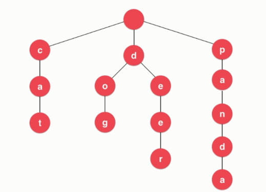

## Trie（前缀树）

#### 什么是Trie字典树

- **多叉树，专门处理字符串**

- **时间复杂度和字典中条目的数量无关，若查询单词的长度为w，时间复杂度为O(w)**

  

- 节点表示

  **当前结点是否代表一个单词的结尾**
  
  **每个结点有若干个指向下一个结点的指针**
  
  ```c++
  class Node {
      boolean isWord;
      Map<char, Node> next;
  };
  ```


#### Trie字典树基础

- Trie字典树的添加


#### Trie字典树的查询

- 对于大数据量的情况下，Trie的效率比二分搜索树的效率高


#### Trie字典树的前缀查询

- NO.208


#### Trie字典树和简单的模式匹配

- NO.211


#### Trie字典树和字符串映射

- NO.677


#### 更多和Trie字典树相关的话题

- Trie的删除操作

- Trie的局限性

  最大的问题：**空间**

  解决：压缩字典树

  三分搜索树

- 后缀树

- 更多字符串问题

  子串查询：KMP/Boyer-Moore/Rabin-Karp

  文件压缩

  模式匹配

  编译原理

  DNA


#### 参考

1. [玩转算法系列--玩转数据结构 更适合0算法基础入门到进阶（java版）](https://coding.imooc.co    m/class/207.html)

